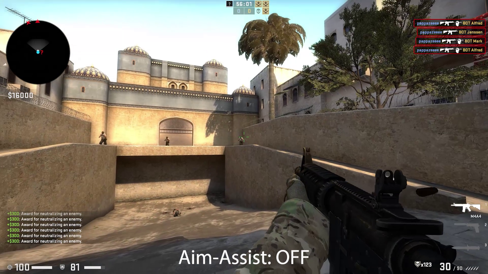
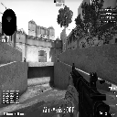

# Waldo Video Preprocessor

Utility script that allows you to convert videos into preprocessed frames. The main use is preprocessing video data for Neural Networks.

## Table of contents

- [Waldo Video Preprocessor](#waldo-video-preprocessor)
  - [Table of contents](#table-of-contents)
  - [Preview](#preview)
  - [How to use](#how-to-use)
    - [With Docker (recommended)](#with-docker-recommended)
    - [Without Docker](#without-docker)
  - [Options](#options)
  - [Other notes](#other-notes)
    - [Remove the container](#remove-the-container)
    - [Error messages](#error-messages)
    - [Bugs](#bugs)
  - [Testing](#testing)

## Preview

```
python3 run.py -s "./data" -f 1
```



```
python3 run.py -s "./data" -f 1 --width 128 --height 128 -g
```



_Credits to Homeless. (https://drive.google.com/drive/folders/1-nK8-WthZyB9G1O9MmAgD3h6CQsYkhUr)_

## How to use

### With Docker (recommended)

1. Make sure you have these dependencies installed on your computer:

- Python3 (3.6-3.9): https://www.python.org/downloads/
- Docker: https://docs.docker.com/engine/install/

2. Build the container video with the following command (takes a minute & approx. 1.1GB):

```sh
python3 build.py
```

3. Process videos with the following command:

```sh
python3 run.py -s "your_folder_path_with_videos"
```

When running the script, by default it will create a new folder `out/` in your current working directory with all the frames split into separate folders.

### Without Docker

There is also the option to run without Docker. However, this can cause errors as you need to manually install and setup opencv-python to work with `cv2.VideoCapture()`.

Make sure to have Python3 installed (see above versions & download link).

1. Set `IS_DOCKER` to `False` in [variables.py](variables.py)
2. Create virtualenv (optional):

```sh
python3 -m venv .venv
source .venv/bin/activate
pip install --upgrade pip
```

3. Install dependencies:

```sh
pip install -r requirements/requirments.txt
```

4. Process videos with this command (same options as the other 'run.py' command):

```sh
python3 main.py -s "your_folder_path_with_videos"
```

## Options

You can view all of the available options with the following command:

```sh
python3 run.py -h
```

The options include:

| Arguments     | Description                                                                         | Required | Default   | Type   |
| ------------- | ----------------------------------------------------------------------------------- | -------- | --------- | ------ |
| -s --src      | The source folder                                                                   | Yes      | -         | `str`  |
| -d --dest     | The destination folder                                                              | No       | `"./out"` | `str`  |
| -f --fps      | The output target fps                                                               | No       | `10`      | `int`  |
| --width       | The output frame width. If not provied, the width will not be resized               | No       | `None`    | `int`  |
| --height      | The output frame height. If not provied, the height will not be resized             | No       | `None`    | `int`  |
| -g --gray     | Convert frames to grayscale                                                         | No       | `False`   | `bool` |
| --silent      | No console logging                                                                  | No       | `False`   | `bool` |
| -t --threads  | The numbers of thread to create in order to process the videos (1 file == 1 thread) | No       | `4`       | `int`  |
| -ni --noinput | Prevent the script from asking user input                                           | No       | `False`   | `bool` |
| -h --help     | Show the list of options                                                            | No       | `False`   | `bool` |

## Other notes

### Remove the container

To remove the container, simply run:

```sh
python3 clean.py
```

### Error messages

You might see this error message in the console:

```
FATAL: exception not rethrown
```

For the moment just ignore it.

### Bugs

Feel free to open a issue if you encounter any problems. [[Open Issue]](https://github.com/leonardcser/waldo-preprocess/issues/new/choose)

## Testing

First make sure you have installed the dependencies found in the [requirements.txt](requirements/requirements.txt). (see [Without Docker](#without-docker))

Test python formatting:

```sh
black --check .
```

Test python linting:

```sh
flake8 .
```

Python run test suite:

```sh
python3 -m unittest discover tests
```

Here again there is a option to run the tests with or without Docker by toggling the `IS_DOCKER` boolean in [variables.py](variables.py).
